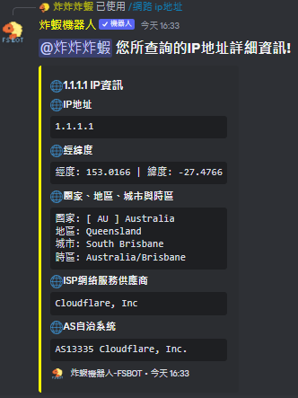

# ⭐ /network ip地址 指令


**注意:** 目前所有指令皆為斜線指令與應用程式指令，不提供一般前綴指令功能


> 查看IP地址或網域資訊!\
> 使用後可以查看IP地理位置、IP所屬通訊公司等等資訊!\
> \
> **所需權限:** 無

<figure><figcaption>
/network ip地址 指令使用後的顯示
</figcaption></figure>

### :star:此指令本地化 | This Command Localized



<table><thead><tr><th data-type="select" data-multiple>支持的語言 | Support Language</th></tr></thead><tbody><tr><td></td></tr></tbody></table>



<table><thead><tr><th data-type="select" data-multiple>支持的語言 | Support Language</th></tr></thead><tbody><tr><td></td></tr></tbody></table>



<table><thead><tr><th data-type="select" data-multiple>支持的語言 | Support Language</th></tr></thead><tbody><tr><td></td></tr></tbody></table>


